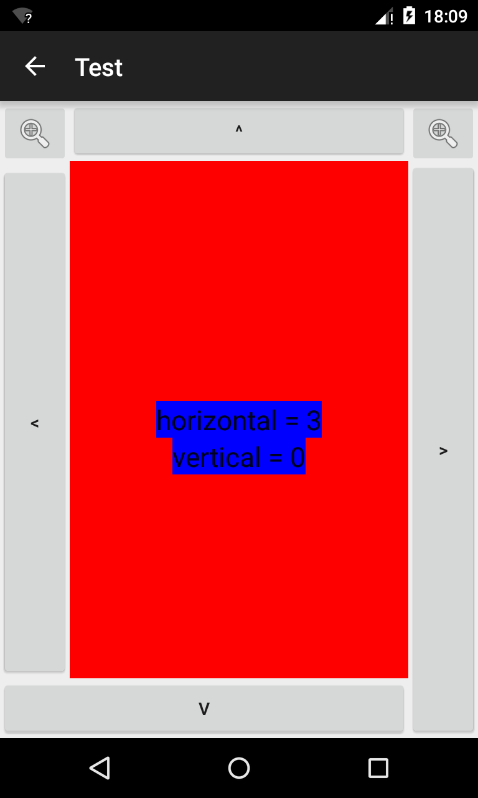

# DoubleFragmentViewPager

Horizontal and Vertical ViewPager

You have to provide a fragment class that inherit from BaseChildFragment and that hide its 2 statics methods `public static Fragment newInstance(int horiz, int vert)` and `getVerticalPagerAdapterList(FragmentManager fm)`.  

```
public class SampleFragment extends BaseChildFragment {

    @Nullable
    @Override
    public View onCreateView(LayoutInflater inflater, ViewGroup container, Bundle savedInstanceState) {
        View rtn = inflater.inflate(R.layout.sample_fragment, container, false);
        Bundle args = getArguments();
        int modulohorizs = args.getInt(MODULO_HORIZ);
        int moduloVERT = args.getInt(MODULO_VERT);
        //...populate your view...
        return rtn;
    }

    @SuppressWarnings("Unused")
    @SuppressLint("Unused")
    public static Fragment newInstance(int horiz, int vert) {
        SampleFragment rtn = new SampleFragment();
        Bundle args = new Bundle();
        args.putInt(MODULO_HORIZ, horiz);
        args.putInt(MODULO_VERT, vert);
        rtn.setArguments(args);
        return rtn;
    }

    @SuppressWarnings("Unused")
    @SuppressLint("Unused")
    public static List<VerticalPagerAdapter> getVerticalPagerAdapterList(FragmentManager fm) {
        Class<SampleFragment> fragClass = SampleFragment.class;
        List<VerticalPagerAdapter> verticalAdapters = new ArrayList<>();
        verticalAdapters.add(new VerticalPagerAdapter(fm, 0, 3, fragClass));
        verticalAdapters.add(new VerticalPagerAdapter(fm, 1, 2, fragClass));
        verticalAdapters.add(new VerticalPagerAdapter(fm, 2, 3, fragClass));
        verticalAdapters.add(new VerticalPagerAdapter(fm, 3, 2, fragClass));
        verticalAdapters.add(new VerticalPagerAdapter(fm, 4, 2, fragClass));
        //the 1st and the 3rd fragments will have 3 vertical fragments inside
        return verticalAdapters;
    }
}
```    


See <a href="https://github.com/DanChaltiel/DoubleFragmentViewpager/tree/master/DoubleViewpagerSample">the Android Studio sample</a> sources for more informations and javadoc.


## How it works
This library uses fragments to make a ViewPager that can be swipe horizontally and vertically.  
It's built upon several vertical viewpagers inside an horizontal viewpager 


## Including in your project
For including the DoubleFragmentViewPager library, you need to include the jitpack repository in your root build.gradle file : 
```    
allprojects {
    repositories { 
        jcenter()
        maven { url "https://jitpack.io" } //add this line
    }
}
```

Then in your app module build.gradle file :
```
dependencies {
    //your other dependencies
    compile 'com.github.DanChaltiel:DoubleFragmentViewpager:v1.0.1'
}
```

## Samples
You can see get a sample project for Android Studio on <a href="https://github.com/DanChaltiel/DoubleFragmentViewpager/tree/master/DoubleViewpagerSample">Android Studio Sample</a>

## Screenshots
Example screenshot



